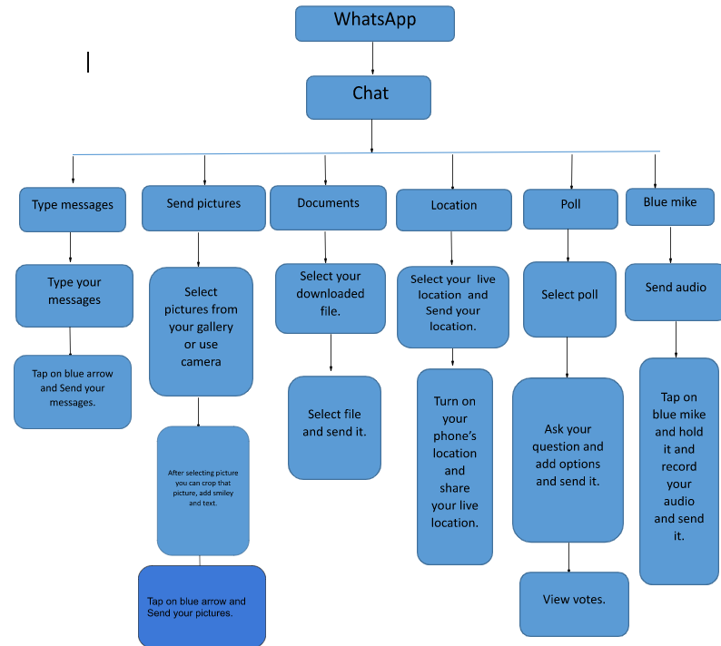

# WhatsApp Task
 This repository is for WhatsApp Task Topic.
 

From Meta.

Version 1.0

## Introduction
WhatsApp is a platform for messaging that everyone needs in today’s World. In today’s daily life WhatsApp is more important than any other app. WhatsApp started to exchange your messages but nowadays the WhatsApp app has improved very well. WhatsApp gives you so many features. You can exchange texts, share photos, videos or make audio and video calls on WhatsApp. You can also share your location when someone wants to find your location. You can keep in touch with your family and friends with the help of WhatsApp. You need a phone number for inviting anyone through WhatsApp. WhatsApp app is available in 40 iOS and 60 Android languages. WhatsApp app type is instant messaging. WhatsApp makes it easy to manage your storage on your device.

### Prerequisites

- Android phone that supports WhatsApp.
- Internet connection.
- Phone number.

#### Getting started with WhatsApp

This section explains the user interface or features of WhatsApp.

***Install WhatsApp***

Install WhatsApp from the official website according to the version of your smartphone.

To install,
1. Visit the app store or Google store.
1. Search for WhatsApp Messenger and tap the top result.
1. Tap to Download.
1. Open WhatsApp and go to the next screen.
1. Agree on Terms of service. 
1. Select your Country.

***Create your WhatsApp account***

Enter your details to create your WhatsApp account.

To create,
1. Open WhatsApp.
1. Enter your phone number.
1. Tap next, or ok to receive the verification code via SMS.
1. Enter a 6 digit verification code.
1. Enter your name. 
1. You can also set a profile photo.

Here See [link](https://en.wikipedia.org/wiki/WhatsApp) for additional information.

#### Working with the Chat feature

This section explains the procedure about Chat feature in WhatsApp.

***Start your conversation with chat feature***

You can communicate with the people in a simple manner with the help of a chat feature. You can share text, share your pictures and videos in the chat feature.You get a notification in blue color that the sender sent you messages. WhatsApp allows you to reply to particular messages. When you are replying to someone at that time that particular person knows you are replying to them.
When you read the sender's message, the sender sees blue ticks on the chat screen.  Sometimes those blue ticks can get you in trouble, especially when you don’t reply instantly and the sender sees you read their message. In settings, you can turn off those blue ticks.In the chat feature you can set your wallpaper for your particular contact. You can apply the same wallpaper for all your chats. You can message in particular groups also. In WhatsApp groups, you can see how many people read your messages or reply.

*start chatting with your contacts*,

To chat,
1. Open WhatsApp.
1. Tap on chats.
1. Select a particular contact that you want to chat with.
1. Tap on the chats text box.
1. Now you can see your phone’s keyboard.
1. Type your message and tap on the blue arrow on the right pane of your text box.
1. When you tap on + sign, on the left pane of the text bar. 
1. You can also express your emotions with the help of emoji’s.
1. When you tap on the blue icon on the right pane of the text bar, you can send audio.
 
 You can send text messages to one person or a group of people. WhatsApp gives you so many features. You can learn how to chat instantly through the following flow chart.

